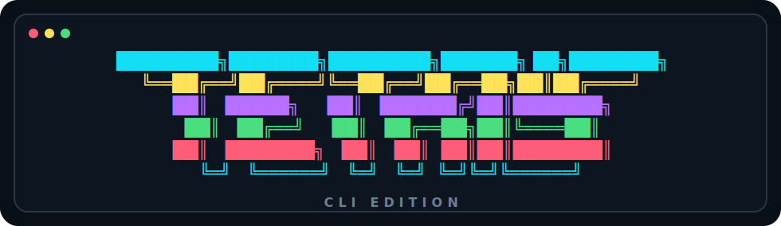
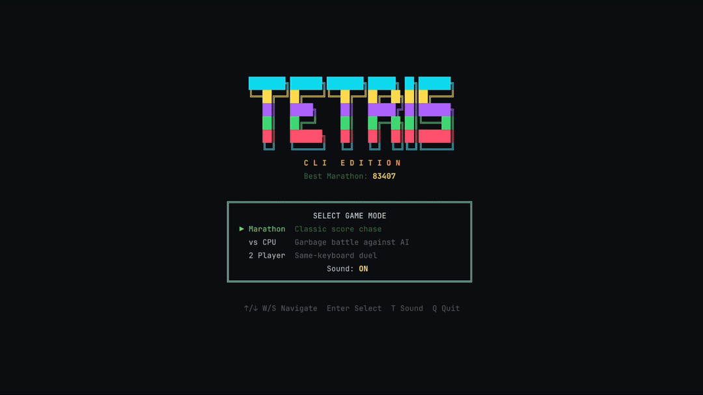

<div align="center">



**A CLI recreation of Tetris — right in your terminal.** 🎮

[](https://www.npmjs.com/package/@engelde/tetris-cli)
[](LICENSE)
[](package.json)



*"The classic puzzle game, rebuilt for the terminal."*

</div>

## 🚀 Quick Start

```bash
npx @engelde/tetris-cli
```

One command. No install. Just play.

> **Want it installed?** Run `npm install -g @engelde/tetris-cli` then just type `tetris`.

## 🕹️ What Is This?

A terminal recreation of **Tetris** — the puzzle game that defined a genre. Seven pieces, one board, infinite challenge. Built with TypeScript, React, and Ink for smooth 60 FPS terminal rendering.

## ✨ Features

- 🏃 **Marathon** — Classic score chase with increasing speed
- 🤖 **vs CPU** — Battle an AI opponent on Easy, Normal, or Hard
- 👥 **2-Player** — Same-keyboard duel with garbage attacks
- 🎲 **7-Bag Randomizer** — Fair piece distribution every game
- 🔄 **SRS Rotation** — Full wall kicks and spin detection
- 📦 **Hold Piece** — Swap and strategize
- 👻 **Ghost Piece** — See exactly where you'll land
- 🔥 **Combos & Back-to-Back** — Advanced scoring for pros
- 🗑️ **Garbage System** — Send lines to your opponent
- 🏆 **Local High Scores** — Persisted in `~/.tetris-cli-scores.json`
- 🔔 **Sound Effects** — Native chiptune-style game cues (disable with `--no-sound`)

## 🎮 Controls

### Player 1

| Action | Keys |
|--------|------|
| Move left | `A` / Left Arrow |
| Move right | `D` / Right Arrow |
| Soft drop | `S` / Down Arrow |
| Hard drop | `W` / Up Arrow |
| Rotate clockwise | `K` / `Z` / Space |
| Rotate counter-clockwise | `J` / `X` |
| Hold | `H` / `C` |
| Pause | `P` / Escape |
| Quit | `Q` / Ctrl+C |

### Player 2

| Action | Keys |
|--------|------|
| Move left | Left Arrow |
| Move right | Right Arrow |
| Soft drop | Down Arrow |
| Hard drop | Up Arrow / Space |
| Rotate clockwise | `,` / `.` |
| Rotate counter-clockwise | `/` / `>` |
| Hold | `;` / `L` |

## ⚙️ Options

| Flag | Description | Default |
|------|-------------|---------|
| `--mode <mode>` | `marathon`, `cpu`, or `2p` | Interactive menu |
| `--difficulty <level>` | `easy`, `normal`, or `hard` | `normal` |
| `--no-sound` | Disable sound effects | Sound enabled |
| `--help`, `-h` | Show help | — |
| `--version`, `-v` | Show version | — |

```bash
# Examples
npx @engelde/tetris-cli --mode marathon --difficulty easy --no-sound
npx @engelde/tetris-cli --mode cpu --difficulty hard
npx @engelde/tetris-cli --mode 2p
```

## 💡 Pro Tips

> 🎯 **Master the hold** — Save an I-piece for the perfect Tetris setup.

> 🔄 **Learn SRS wall kicks** — A well-timed rotation can save a piece from a tight spot.

> ⚡ **Combos add up** — Clearing lines back-to-back sends massive garbage in versus modes.

> 🏓 **Watch the ghost** — The ghost piece shows your landing spot. Use it to plan ahead.

## 🛠️ Development

```bash
git clone https://github.com/engelde/tetris-cli.git
cd tetris-cli
npm install
```

| Command | Description |
|---------|-------------|
| `npm start` | Run the game |
| `npm test` | Run tests |
| `npm run build` | Compile TypeScript |
| `npm run lint` | Lint with Biome |
| `npm run format` | Format with Biome |

[Husky](https://typicode.github.io/husky/) runs linting + tests on pre-commit and enforces [Conventional Commits](https://www.conventionalcommits.org/). CI runs on Node 22 / 24. npm publishing is triggered from a published GitHub Release using trusted publishing and provenance.

## 📜 Credits

Inspired by the original **Tetris** created by **Alexey Pajitnov** in 1984. This is an independent, open-source recreation with no affiliation with The Tetris Company.

## 📄 License

[MIT](LICENSE)
